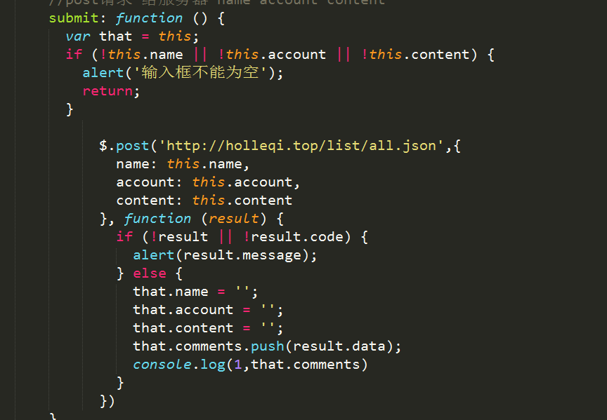

##12-2随笔

----
#### 实现一个类似留言版的功能。

1.用bootstrao和vue搭了一个页面  地址 ： http://holleqi.top/ajax/index2.html

2.$get 获取API数据

可是我用的别人的接口，肯定不行啊，我就copy都自己域名下，如下：http://holleqi.top/list/all.json
打开之后就乱码了，然后我就在本地测试下了，

报错了，我就想什么情况，API与我的域名下的JSON文件就不一样，呵，难道我自己要做个API，关键不会阿，就百度搜啊，去土哥的群里问啊，才知道是同源问题

在这里也感谢，积极帮我解决问题的人

3.延伸的同源策略（解决跨域）
就去百度啊，还是阮大神文档靠谱

JSONP是服务器与客户端跨源通信的常用方法。最大特点就是简单适用，老式浏览器全部支持，服务器改造非常小。

WebSocket是一种通信协议，使用ws://（非加密）和wss://（加密）作为协议前缀。该协议不实行同源政策，只要服务器支持，就可以通过它进行跨源通信。

CORS是跨源资源分享（Cross-Origin Resource Sharing）的缩写。它是W3C标准，是跨源AJAX请求的根本解决方法。相比JSONP只能发GET请求，CORS允许任何类型的请求。

搞了大半天，直接暴力解决，把html直接上传我的同域名下不就得了。

------

####今天遗留问题：
 只是用get 请求到数据然后用vue 渲染到页面，用 post发送数据
有响应，没有push 到comments数组里。

也就导致发送表单不报错，也不会渲染到页面。