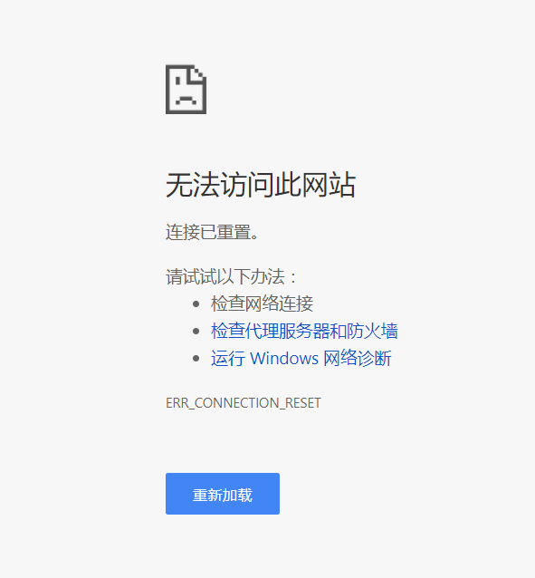
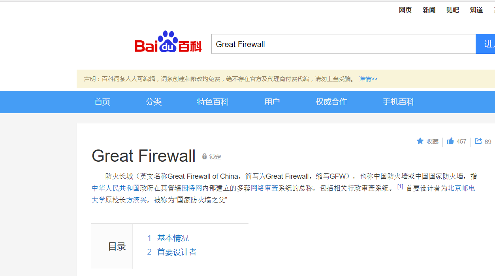
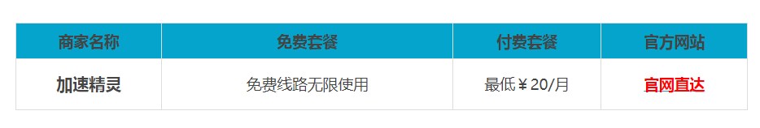

# 如何简单的科学上网

第一次看到科学上网很好奇，上网谁不会？还有什么科学不科学的。现在才知道自己只不过是在一堵墙内上个局域网罢了，并没真正接触过真正的互联网。既然想学点东西，就不能被网络束缚住。
 -------------------

#### 那么什么是科学上网呢？

在21世纪，互联网已经成为人们交流的重要平台，无论在世界的那个地方，人们都可以通过互联网来互换知识和交流，在大陆，由于一些特殊的原因，人们无法使用全球最大的搜索引擎谷歌，也无法看在全球最大的视频分享网站Youtube，
	

这些被屏蔽的网站，通常称为被墙（GFW）

墙，一般指中国政府监控和过滤互联网内容的软硬件系统用，用于监控网络上的通讯，对认为不符合中国官方要求的传输内容，进行干扰、阻断、屏蔽。

GFW主要使用下列技术来阻止你正常上网：

域名解析服务缓存投毒污染
针对境外的IP地址封锁
IP地址特定端口封锁
无状态TCP协议连接重置
对加密连接的干扰
TCP协议关键字阻断
对破网软件的反制
间歇性完全封锁
针对IPv6协议的审查
对电子邮件通讯的拦截 

####     既然墙外那么精彩，我们为什么不翻一翻？

目前工具主要有VPN、SSH、Shadowsocks、牛人开发的浏览器插件。下面我们一项一项来介绍。

 1、利用VPN进行科学上网

VPN一般指虚拟专用网络，那么VPN科学上网也就是通过建立一个国外的虚拟专用网络，绕过厉害的GFW防火墙来访问国外的网站，比如Google、Facebook、Youtube及Twitter等。

所谓VPN科学上网，我们必须先找到一个VPN服务器（IP），可以是自己购买国外的VPS搭建，也可以是用他人已搭建好的VPN服务，当然，对于小白用户来说，这个算是比较难的。

分享几个比较靠谱的VPN商：

 
2、Shadowsocks

Shadowsocks （中文名称：影梭，简称SS）是一个开源项目，开源在 GitHub，拥有 Android , Mac , Windows 版本等各大平台版本。

Shadowsocks的运行原理与其他代理工具基本相同，使用特定的中转服务器完成数据传输。在服务器端部署完成后，用户需要按照指定的密码、加密方式和端口使用客户端软件与其连接。在成功连接到服务器后，客户端会在用户的电脑上构建一个本地Socks5代理。浏览网络时，网络流量会被分到本地socks5代理，客户端将其加密之后发送到服务器，服务器以同样的加密方式将流量回传给客户端，以此实现代理上网。

因此我们只需要下载 Shadowsocks 客户端即可，然后可以在 Shadowsocks（已经够用了，你也可以自行搜索免费的Shadowsocks服务器， 注意天下没有免费的午餐） 找到三个免费账号，密码6个小时更新一次：

然后比如在 Windows 客户端中填入如下信息即可连接：

**3、**  蓝灯Lantern 曾经是一个完全免费的应用程序，拥有 Android , Mac , Windows 版本，开源在 GitHub 。但是随着知名度增加，Lantern 提供了专业版帐户(￥336 2年，￥216 1年)。但是如果不是重度用户，免费用户足够。免费用户每个月有 500M 不限速流量，超过 500M 之后速度会被限制，但是浏览网页、非高清视频已经足够。蓝灯Lantern的安装相当的简单，跟普通的软件一样，只要一个下一步就OK了。小白用户也非常容易上手，所有很受大家欢迎。

安装  https://github.com/getlantern/forum/issues/833

点击下载完毕之后，出现如下界面：

现在可以随意输出国外的网站浏览使用啦（不用登陆注册也可使用）
